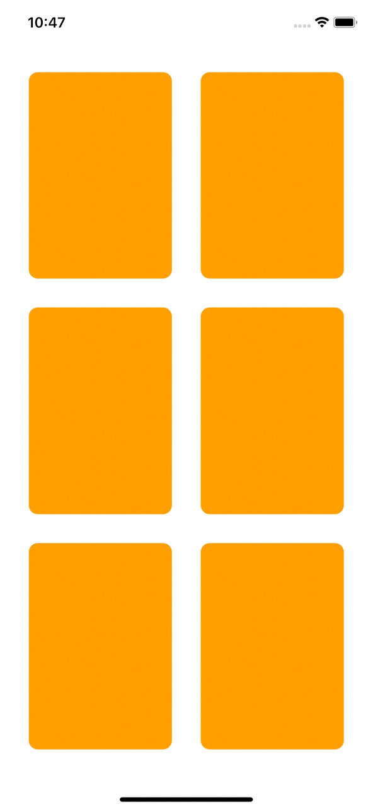
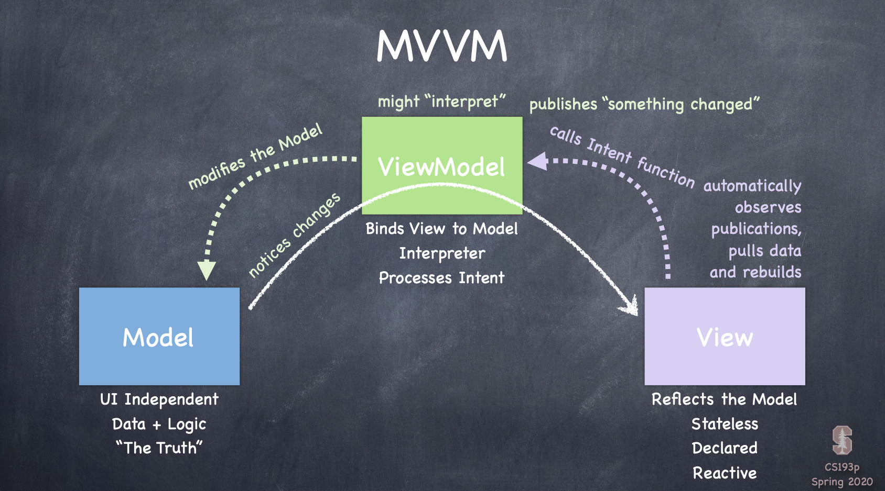

# Memorize Game

Match the cards with same pattern using memory.

## Game Play

Demo game play iPhone11 simulator recording:

    

Assignment 2 game play iPhone11 simulator recording:

## Model - View - ViewModel (MVVM)

The game use Model-view-viewmodel (MVVM) architectural design paradigm.

